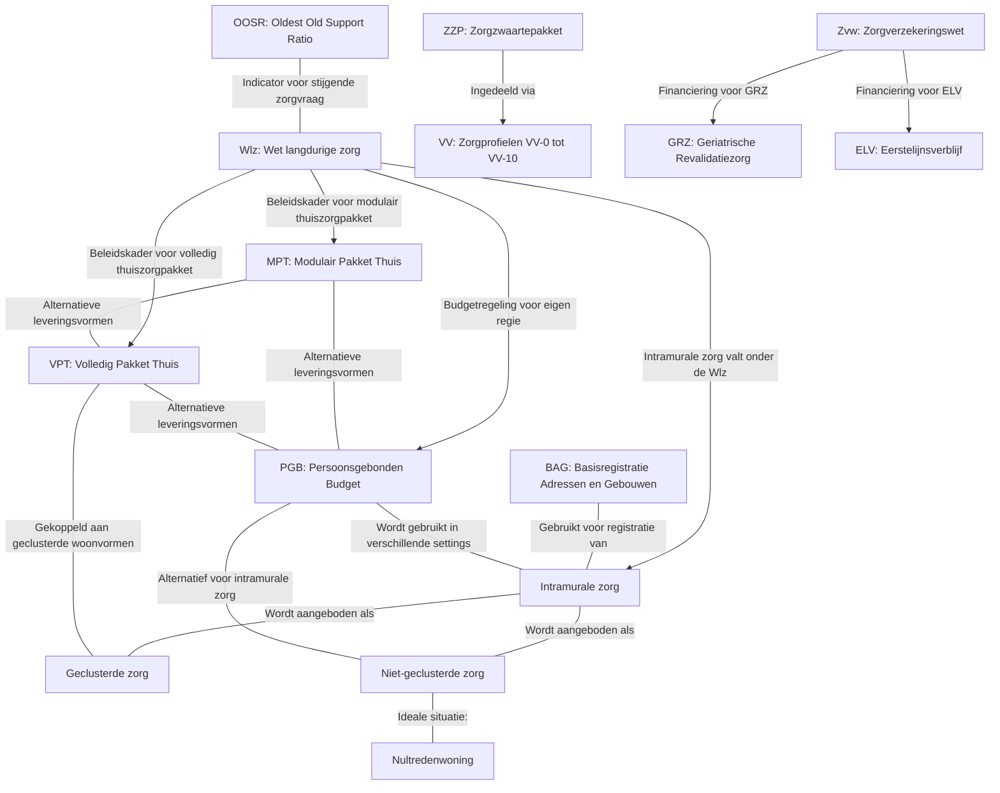

# Begrippenlijst

Dit overzicht is samengesteld op basis van de afkortingen en bijbehorende toelichtingen in de Regiomonitor voor verpleegzorg (Regiomonitor-Arnhem-2023) en het TNO-rapport over de prognose capaciteitsontwikkeling verpleeghuiszorg (fase II)

**Wlz**  
_Wet langdurige zorg_  
De Wlz regelt de langdurige zorg voor mensen die 24 uur per dag nabijheid en/of permanent toezicht nodig hebben, zoals kwetsbare ouderen, mensen met een beperking en mensen met een psychische aandoening. Verzekerden met een Wlz-indicatie kunnen kiezen voor opname in een instelling of voor zorg in de thuissituatie via specifieke leveringsvormen.

**MPT**  
_Modulair Pakket Thuis_  
Via de leveringsvorm MPT kunnen verzekerden thuis zorg ontvangen van één of meer Wlz-zorgaanbieders. Ze hebben hierbij tevens de mogelijkheid om sommige zorgvormen direct via de zorgaanbieder te laten leveren en de overige zorg zelf te inkopen met een Persoonsgebonden Budget (PGB).

**VPT**  
_Volledig Pakket Thuis_  
Bij VPT is één Wlz-zorgaanbieder volledig verantwoordelijk voor de coördinatie en levering van de totale zorg aan de verzekerde. Deze zorg kan zowel in de thuissituatie als in een geclusterde woonvorm worden geleverd.

**PGB**  
_Persoonsgebonden Budget_  
Via het PGB-Wlz ontvangt de verzekerde een budget waarmee hij of zij zelf zorg kan inkopen. Dit budget biedt de mogelijkheid tot meer regie over de eigen zorgverlening.

**Intramuraal**  
_Verblijf in een instelling_  
Intramurale zorg betreft de situatie waarin een cliënt in een instelling woont en daar de zorg ontvangt waarvoor hij of zij is ingericht. De zorg wordt geleverd op basis van het vastgestelde zorgzwaartepakket.

**Geclusterde zorg**  
_Wonen in een geclusterde woonvorm_  
Dit verwijst naar woonvormen waarbij mensen die langdurige zorg nodig hebben samen in een woonruimte (bijvoorbeeld een geclusterde woonvorm) wonen. De zorg wordt gezamenlijk geregeld door één of meerdere gecontracteerde Wlz-zorgaanbieders, vaak via leveringsvormen als VPT.

**Niet-geclusterde zorg**  
_Zorg aan huis_  
Verzekerden die kiezen voor niet-geclusterde zorg ontvangen de Wlz-zorg in hun eigen woning – bijvoorbeeld in een aanleunwoning of een woning die zelf wordt gehuurd/bezit – en kunnen hiervoor gebruikmaken van de leveringsvormen VPT, MPT en/of PGB.

**Nultredenwoning**  
_Woning zonder drempels_  
Bij een nultredenwoning zijn alle belangrijke woononderdelen – zoals woonkamer, keuken, badkamer, toilet en ten minste één slaapkamer – op één begane grond en daardoor toegankelijk zonder trappen, ook van buitenaf.

**ZZP**  
_Zorgzwaartepakket (ZZP)_  
In de context van de Wlz wordt vaak gesproken over zorgzwaartepakketten, die aanduiden welke intensiteit van zorg een cliënt nodig heeft. De term “ZZP” wordt in sommige grafieken gebruikt om de mix van deze pakketten weer te geven. (Let op: in andere contexten staat ZZP vaak voor ‘zelfstandige zonder personeel’, maar hier verwijst het naar de zorgzwaartepakketten in de langdurige zorg.)

**VV (zorgprofielen VV-0 t/m VV-10)**  
_Zorgprofielen voor intramurale zorg_  
In de Wlz worden cliënten ingedeeld in verschillende zorgprofielen (bijv. VV-0, VV-1 tot en met VV-10). Deze profielen geven de aard, inhoud en globale omvang van de benodigde zorg weer. Zo worden cliënten met een lagere zorgintensiteit (bijvoorbeeld VV-1 t/m 3) van degenen met een hogere intensiteit (bijvoorbeeld VV-4 en hoger) onderscheiden.

**OOSR**  
_Oldest Old Support Ratio_  
Deze indicator geeft de verhouding weer tussen de groep 50–74-jarigen, die doorgaans mantelzorg verleent, en 85-plussers, die meestal zorg nodig hebben. Een dalende OOSR duidt op een afname van de beschikbaarheid van mantelzorg en kan leiden tot een verhoogde vraag naar professionele langdurige zorg.

**BAG**  
_Basisregistratie Adressen en Gebouwen_  
De BAG is de officiële Nederlandse databank met adressen en gebouwinformatie. Deze registratie wordt onder andere gebruikt voor het in kaart brengen van de fysieke capaciteit van verpleeghuizen.

**Zvw**  
_Zorgverzekeringswet_  
Deze wet regelt de basisverzekering voor curatieve zorg in Nederland. In de context van verpleeghuiszorg worden zorgvormen als Geriatrische revalidatiezorg (GRZ) en eerstelijnsverblijf (ELV) vaak niet meegenomen, omdat zij via de Zvw worden gefinancierd.

**GRZ**  
_Geriatrische Revalidatiezorg_  
Verwijst naar revalidatiezorg voor ouderen, die doorgaans apart van de intramurale verpleeghuiszorg wordt geregistreerd.

**ELV**  
_Eerstelijnsverblijf_  
Dit betreft kortdurende verblijfsvoorzieningen voor ouderen, die eveneens via de Zvw gefinancierd worden en dus doorgaans buiten de onderhavige analyse vallen.

